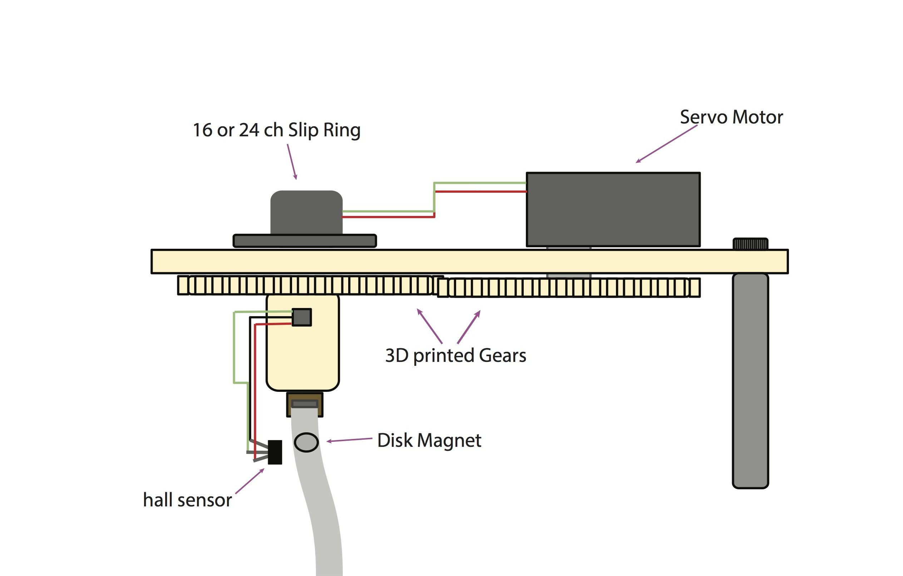
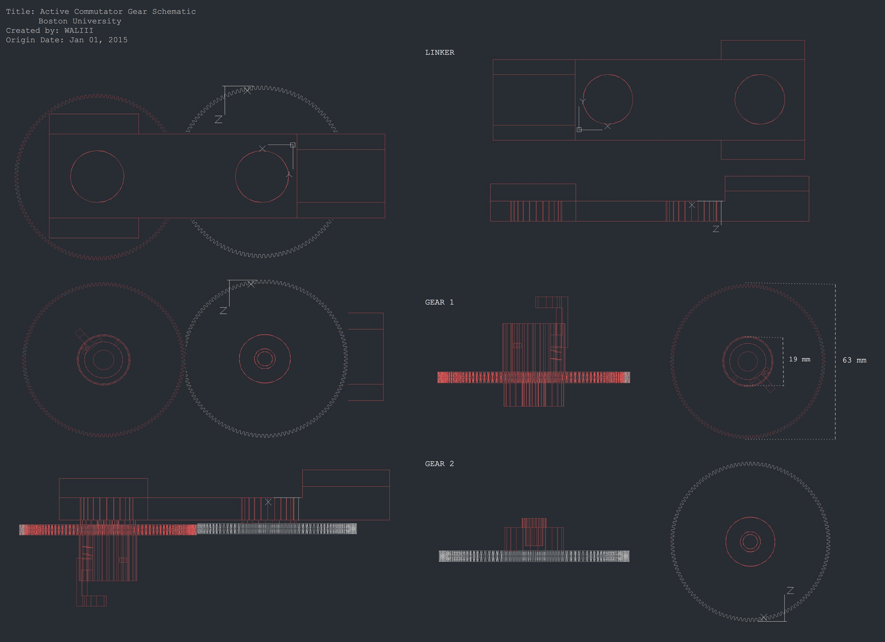
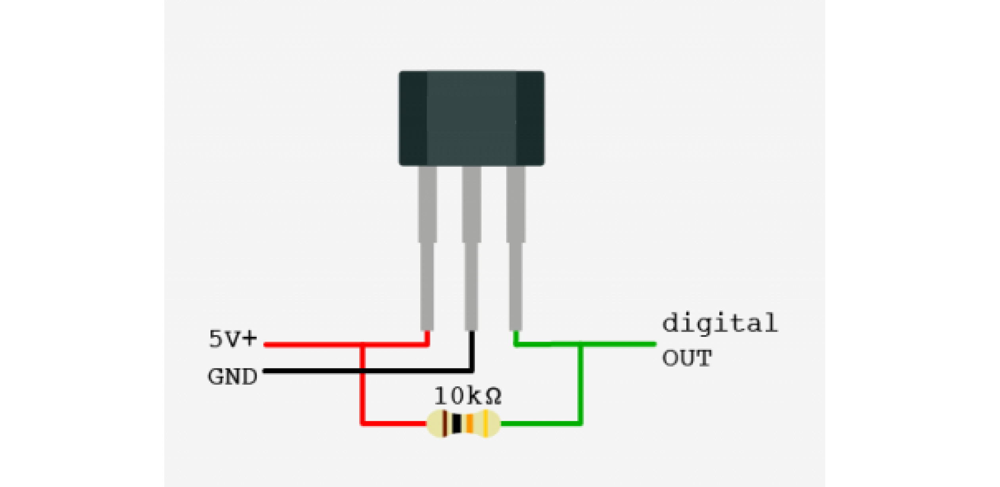

# ActiveComm

The ActiveComm is a simple low noise active(driven by a motor and sensor) commutator designed for ABA electrophysiology and optophysiology.

Parts List:
https://docs.google.com/a/bu.edu/spreadsheets/d/18mCksBi6qS9Ah4pYq2-t6xsRfTHRStpMuj2Iyy4ihCQ/edit?usp=sharing

## Assembly

 Get 3D printed files, these can be ordered through 3D hubs, local hackerspace/makespace, or local university service.

 Boston University has mid/low-resolution 3D printing  on site-

Schematic:

### Wiring Diagram:
The wiring is simple. Here is a simple wiring diagram of the circuit:

On the Arduino:

    PIN 09: Servo output
    PIN A0: Hall sensor output

Make sure the Hall sensor is wired correctly:

On the serial monitor, with no magnet, pin A0 should read ~512. Bringing a magnet close to the sensor will cause this value to increase or decrease, depending on the deflection. The sketch is programmed to do this already.

On the cable, the Magnet should sit just below the hall sensor (see IMAGES dir)

## Inspiration:
This was inspired by work done in Michale Fee's lab, by Anthony Leonardo.  

http://web.mit.edu/fee/Public/Publications/FeeLeonardo2001.pdf
