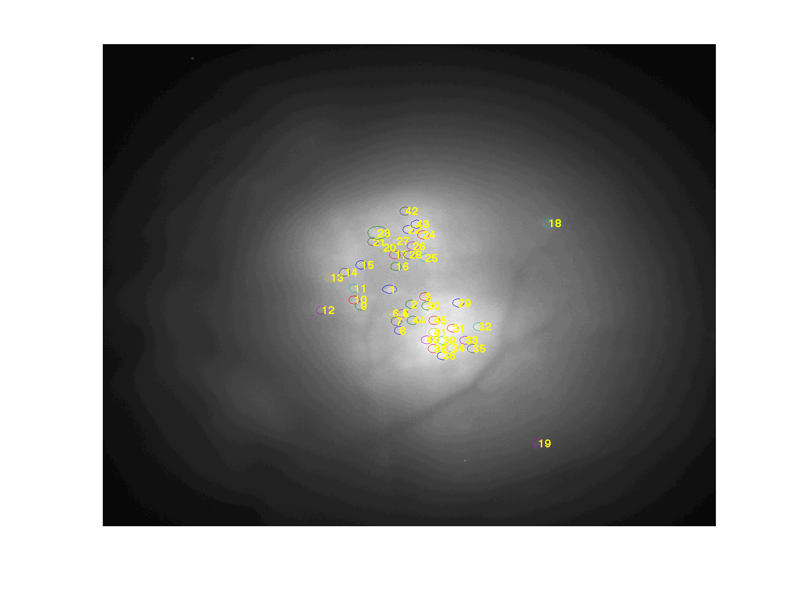
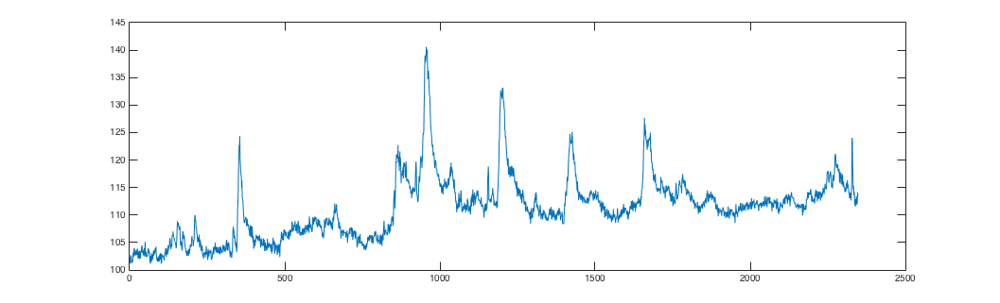
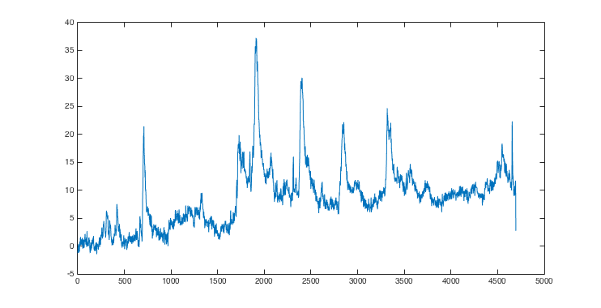

# Archive
Archived code- original edit


1. Log each .tif/.tiff file from each recording session in  a dedicated directory for each session. i.e. store each animal in a separate directory ( I typically have a subfolder for each day of imaging.)


2. When you are done for the day/session, open the directory you made in the last step in matlab, and run SM_Parse. This will separate video blocks in .m files ( so its easy to manipulate in matlab)


3. Run:

```
>> SM_BatchDff
```

...which will make a downsampled, background subtracted video as well as a maximum projection image for each file in your directory. In addition, it will make a maximum-maximum projection image called Dff_composite, of all the recordings from the session combined.


3b. Extract ROIs manually:
load the Dff_composite image into MATLAB:

```
>> IMAGE = imread('Dff_composite');
```
...Or, if you want to just take an ROI mask from one particular image:


```
>> IMAGE = imread('CaptureSession'); % or whatever you name you file...
```


Then, create your ROI mask:
```
>> FS_image_roi(IMAGE);
```
This will open up a GUI to select ROIs from the image you picked. just point over an ROI, click on one you want, drag the mouse out so you get the right size, then unclick your mouse. Then DOUBLE CLICK on the ring you made. it should turn yellow. then you can drag/move the ring over to make another selection.  You can add/move as many ROIs as you want. when you are done, just exit out of the GUI. It will save all your ROIS, and number them...





Then, go into the new 'roi_image' directory and load ROI masks into MATLAB...
```
>> load('roi_data_image.mat')
```

To extract ROIS from your movies, go back into the .mat directory, and run:

```
>> roi_ave= FS_plot_roi2(ROI);
```

roi_ave will be saved in the directory 'rois' and it will have all of your ROI time series data in it, as well as calculated dF/F traces, and interpolated traces. you can thumb through the .mat file to check out the data structure. to plot it right away:
```
>> figure(); plot(roi_ave.interp_dff(:,:,1)) % interpolated df/f
```



```
>> figure(); plot(roi_ave.raw{1}) % raw signal
```



==========================================================

## OPTIONAL CODE

I. To eliminate 'bad' frames semi-automatically, run:

```
SM_ProcessROIS
```


...This will eliminate bad frames ( where the light turned on/off early) from the videos, that may interfere with calculating SNR.
