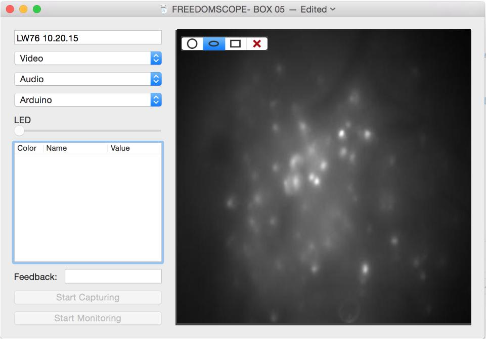

# FreedomScope
============
## Overview

The project is now in beta.

#### Hardware Components:
### FreedomScope
The FreedomScope is a lightweight (<2g) 3D printed microscope for biological imaging, specifically designed for fluorescence calcium imaging in Zebra Finches and other small animals.

Parts List:
https://docs.google.com/a/bu.edu/spreadsheets/d/1X6249HvX6Zhh-KnQvc4uEf_1f7gnXYBuc04Sh4Ooo6Y/edit?usp=sharing

Detailed Assembly Schematic:
https://docs.google.com/a/bu.edu/spreadsheets/d/1X6249HvX6Zhh-KnQvc4uEf_1f7gnXYBuc04Sh4Ooo6Y/edit?usp=sharing

### DAQ BOX
The DAQ converts/syncs audioIN and video, Triggers in/out, and also controls LED power levels

Cable Wiring: https://docs.google.com/a/bu.edu/drawings/d/18Dm9MpK5yCYzgoE184fAivyCe2NFyLcQP5wxAE53_zA/edit?usp=sharing

Detailed Assembly Schematic:
https://docs.google.com/a/bu.edu/drawings/d/18Dm9MpK5yCYzgoE184fAivyCe2NFyLcQP5wxAE53_zA/edit?usp=sharing

Connectors:  http://www.advanced.com/products/board-to-board-connectors/mezza-pede-smt-connectors/table-of-models

## SOFTWARE

#####NEW Software (MAC 10.7 or later):

Figure: Brightfield imagiing

Figure: Single channel fluorescence imaging, at cellular resolution. Low-Latency ROI information for BMI experiments.

## TUTORIALS
coming soon!

#Contact:
email bliberti@bu.edu

Inspiration: http://www.nature.com/nmeth/journal/v8/n10/full/nmeth.1694.html
