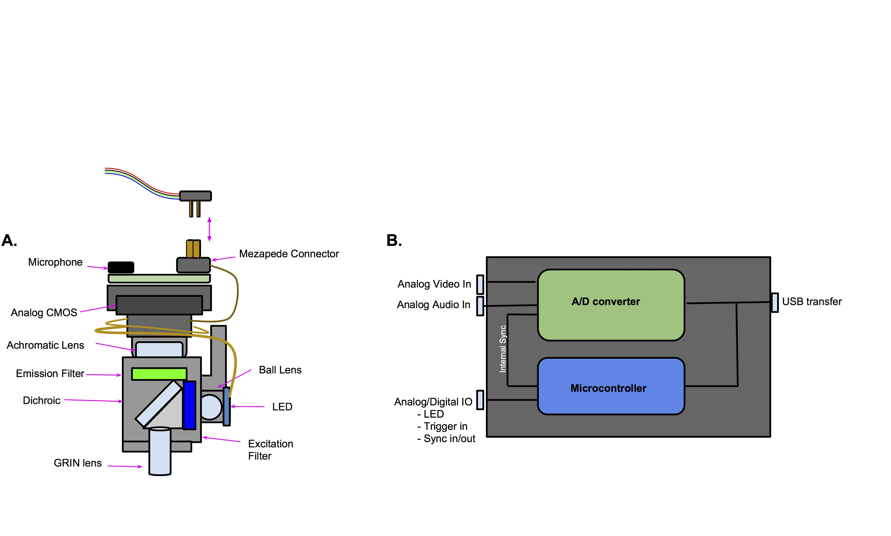

#FreedomScope 
============

##Overview

The project is now in beta. 

#### Hardware Components: 
###FreedomScope
The FreedomScope is a lightweight (<2g)  microscope for biological imaging.

Parts List:
https://docs.google.com/a/bu.edu/spreadsheets/d/1X6249HvX6Zhh-KnQvc4uEf_1f7gnXYBuc04Sh4Ooo6Y/edit?usp=sharing

###DAQbox
The DAQ converts/syncs audioIN and video, and controls light levals

Cable Wiring: https://docs.google.com/a/bu.edu/drawings/d/18Dm9MpK5yCYzgoE184fAivyCe2NFyLcQP5wxAE53_zA/edit?usp=sharing

Connectors:  http://www.advanced.com/products/board-to-board-connectors/mezza-pede-smt-connectors/table-of-models 

##SOFTWARE

#####NEW Software (MAC 10.7 or later):

figure: Brightfield imagiing 

figure: Single channel fluorescence imaging, at cellular resolution 

## TUTORIALS
coming soon!

#Contact:
email bliberti@bu.edu

