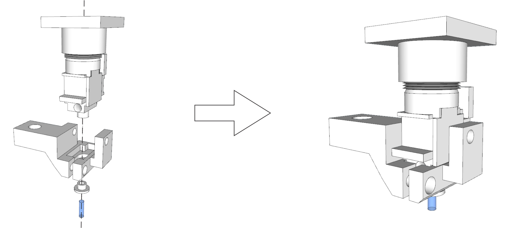
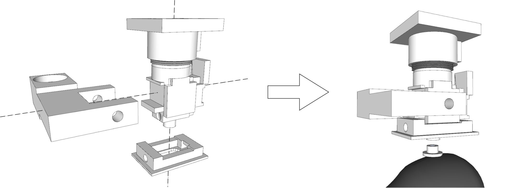

 Freedom Scope v2
=======

============

## Overview
FinchScope v2 is an itteration of the FinchScope initially developed by Will Liberti in the Gardner Lab. These designs were developed by William Yen in the Cruz-Martin Lab and Daniel Leman in the Gardner Lab with several goals in mind. 

1: The design must be fully removable such that animals can be co-housed without the risking damage to the device. 
2: The design must allow for accurate and repeatable placement such that the same imaging plane can be obtained over the course of an experiment.
3: Increase the ease of use of the overall system starting with the lens implant surgery.

To tackle these issues we have redesigned the body and baseplate for the original the FinchScope along with developing several new accessories that are compatable with both the original FinchScope and the FreedomScopeV2. All parts and modifications are described below.

All parts are printed using a Formlabs Printer with FLGPBK04 black resin at a 0.025mm resolution. Parts are then post-processed with the Formlabs Form Wash and Form Cure systems following the recommended protocols.

## Components:

### FinchScope v2

The FinchScope v2 incorporates a tongue and groove design to fit with the new Baseplate v2. This allows for the scope to be easily removed and placed in the same location over the course of a multi-day experiment.

### Baseplate v2

This new baseplate is designed to be impanted chronically on an animal and allows for the FinchScope v2 to be attached and detatched as needed using a set screw. The opening of the setscrew must be threaded with a M2 x 0.40mm tap (see parts list).

### Stereomount

The Stereomount is designed to properly align the FinchScope v2 with a relay lens for implanting. It attatches to standard optics cage rods with a corresponding 1/4" or 6mm screw (see parts list), which can then be mounted on a stereotaxic setup. M2 x 4mm screws are used to secure the relay GRIN adapter and the FinchScope v2 to the Stereomount. These openings should also be threaded with a M2 x 0.40mm tap.

### GRIN adapter (Top Hat)

The GRIN adapter is designed to receive a 1mm diameter GRIN relay lens for implanting and is designed to be chronically implanted with the animal, sitting just above the skull.

### Baseplating Mount

The Baseplating Mount is designed to aid in the baseplating process by securely holding the FinchScope v2 with attached baseplate. As with the Stereomount, the Baseplate Mount attaches to standard optics cage rods with a corresponding 1/4" or 6mm screw (see parts list), which can then be mounted on a stereotaxic setup. M2 x 4mm screws are used to secure the FinchScope v2 in place. These openings should also be threaded with a M2 x 0.40mm tap.

### Baseplate Cover v2

The Baseplate Cover v2 is designed to fit over the baseplate after it has been implanted on an animal. It can be using two points of contact with UV cure dental acrylic (see parts list). It protects the baseplate while animals are co-housed and can be easily removed by cutting the acrylic with a standard pair of wire cutters.

### UCLA CMOS Mount

We have also created an adapter in order to mount the [UCLA CMOS](http://miniscope.org/index.php?title=Main_Page) sensor to the FinchScope v2. This design can be modified to fit any board-level CMOS sensors for use with the FinchScope v2 design.

*