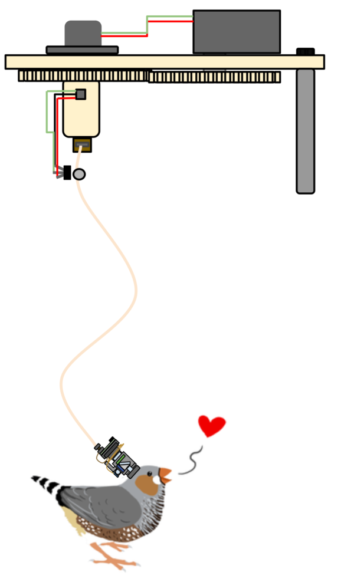

#FreedomScope Project
============

##Overview
The FreedomScope project aims to develop a modular in-vivo ABA (awake, behaving animal) optophysiology rig, with a transparent acquisition and analysis pipeline.

The project is now active

####Components:
###Finchscope
The FinchScope is a lightweight (<2g) dual channel, lightweight microscope for biological imaging.

###ActiveCom
The ActiveCom is a low noise active(driven by a motor and sensor) commutator designed for ABA electrophysiology and optophysiology.
