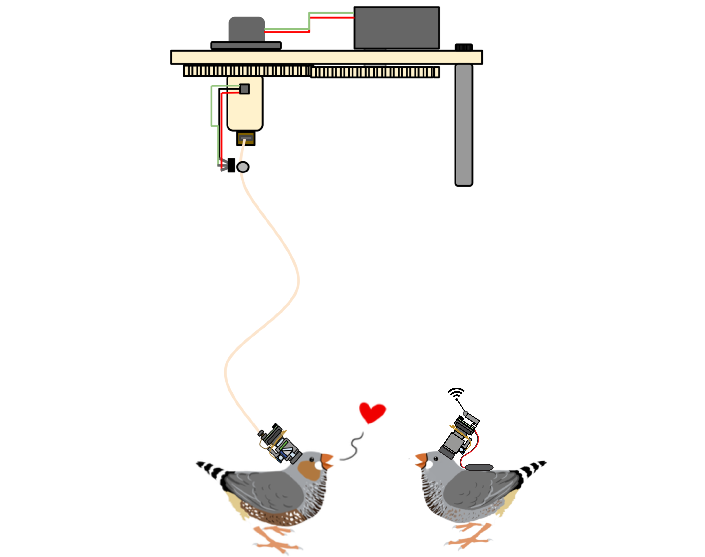
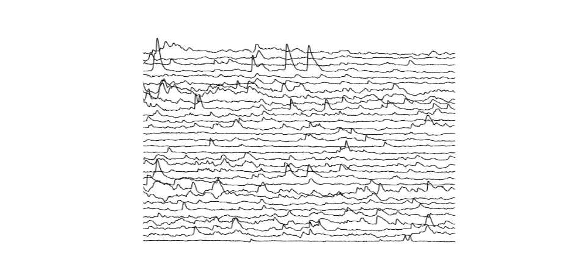

 FreedomScope Project
=======

============

## Overview

FreedomScope is an umbrella project for several customizable and scaleable single-photon fluorescent imaging microscope systems that take advantage of developing open-source landscape to provide a modular in-vivo  all optical neurophysiology rigs with a transparent hardware, and  acquisition and analysis software.

You can read more about the project [here.](http://iopscience.iop.org/1741-2552/14/4/045001/)

The project was developed by [Will Liberti](https://github.com/WALIII) in the [Gardner Lab](http://people.bu.edu/timothyg/Home.html), for multi-month imaging of neural activity in songbirds [[1]](https://doi.org/10.1371/journal.pbio.1002158) [[2]](https://www.nature.com/articles/nn.4405) [[3]](https://ccneuro.org/2018/proceedings/1133.pdf) bats, and rodents. This effort would not have been possible without the critical advice and support at the outset of the project by Daniel Aharoni and Peyman Golshani, of the [UCLA Miniscope project](http://miniscope.org/index.php?title=Main_Page)

#### Components:

### Finchscope Microscope

The FinchScope is a lightweight wireless-capable microscope for biological imaging- Designed specifically for monitoring the neural activity (via genetically encoded calcium indicators) of zebra finches while they sing their courtship songs. You can find the Construction and Assembly Guide for [the Microscope](https://github.com/WALIII/FreedomScope/wiki/Assembly-Guide), As well as a for the [Data Acquisition Box (DAQ)](https://github.com/WALIII/FreedomScope/wiki/DAQ-Guide).  Also, we have a [Guide Through a Basic Analysis Pipeline](https://github.com/WALIII/FreedomScope/wiki/Analysis-Guide)

#### Wireless Finchscope
The FinchScope is wireless capable and is being used in bats with the Yartsev lab. additional resources related to this project can be found (here.)https://github.com/WALIII/ImBat

### 1P2C Microscope (Under Development)
The 1P2C Miniscope is a variant of the FinchScope that incorporates a second excitation path for dual color imaging, or for widefield photo- stimulation.  You can find the Construction and Assembly Guide for [the Microscope](https://github.com/WALIII/FreedomScope/wiki/Assembly-Guide), As well as a for the [Data Acquisition Box (DAQ)](https://github.com/WALIII/FreedomScope/wiki/DAQ-Guide).

### Widefield Microscope (Under Development)
The WideField miniature microscope weighs 4g and gives a 4x3mm field of view. You can find the Construction and Assembly Guide for [the Microscope](https://github.com/WALIII/FreedomScope/wiki/Assembly-Guide), As well as a for the [Data Acquisition Box (DAQ)](https://github.com/WALIII/FreedomScope/wiki/DAQ-Guide).

### Active Commutator
The [Active Commutator](https://github.com/WALIII/FreedomScope/wiki/Commutators) is a low cost, low noise, active (driven by a motor and sensor) electrical rotary joint designed for electrophysiology (single and multichannel micro-electrode arrays) and optophysiology ( optogenetics, miniature microscopes, and fiber photometry).

### Referencing
If you use any part of this project in your work, please cite our Journal of Neural Engineering Paper:

[Liberti III, William A., et al. "An open source, wireless capable miniature microscope system." Journal of neural engineering 14.4 (2017): 045001.](http://iopscience.iop.org/1741-2552/14/4/045001/)

### Associated Publications/Presentations
* [Liberti III, William A., et al. "An open source, wireless capable miniature microscope system." Journal of neural engineering 14.4 (2017): 045001.](http://iopscience.iop.org/1741-2552/14/4/045001/)
* Liberti, William A., et al. "Unstable neurons underlie a stable learned behavior." Nature neuroscience 19.12 (2016): 1665-1671.
* Yanny, K., Antipa, N., Liberti, W., et al. (2020). Miniscope3D: optimized single-shot miniature 3D fluorescence microscopy. Light: Science & Applications, 9(1), 1-13.
* Leman, Daniel P., et al. "Large-scale cellular-resolution imaging of neural activity in freely behaving mice." bioRxiv (2021).
* Cohen, Yarden, et al. "Hidden neural states underlie canary song syntax." Nature 582.7813 (2020): 539-544.
* Leman, Daniel P., et al. "Imaging During Odor-Guided Behavior With a Novel, Wide Field-of-View Miniature Fluorescence Microscope." CHEMICAL SENSES. Vol. 44. No. 7. GREAT CLARENDON ST, OXFORD OX2 6DP, ENGLAND: OXFORD UNIV PRESS, 2019.

## Contributors:
* [Will Liberti](wliberti@berkeley.edu) ( U.C. Berkeley)
* [Nathan Perkins](lnp@bu.edu) ( Apple )
* [Daniel Leman](dpleman@bu.edu) ( Brandeis)
* [Jasmine Clevenger](jrclev@bu.edu) ( B.U.)
* [Will Yen](yenw24@gmail.com) (B.U.)

##  Major Contributing Labs
* [Gardner Lab](idavison@bu.edu)
* [Otchy Lab](idavison@bu.edu)
* [Davison Lab](idavison@bu.edu)  
* [Cruz-Martin Lab](idavison@bu.edu)  
* [Carmena Lab](idavison@bu.edu)  
* [Yartsev Lab](idavison@bu.edu)
